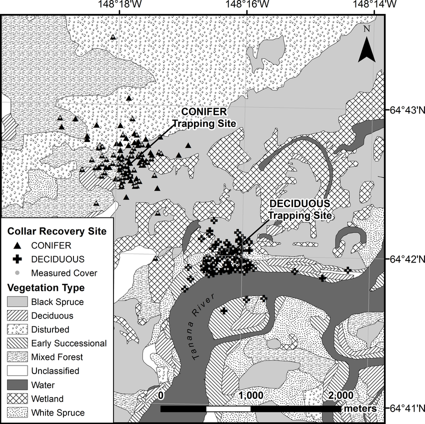

```{r setup, include=FALSE, warning = FALSE, message = FALSE}
knitr::opts_chunk$set(echo = FALSE, message = FALSE, warning =FALSE, fig.align = 'center', out.extra = 'angle = 90')

library(tidyverse)
library(lubridate)
library(kableExtra)
library(here)
library(janitor)
library(effsize)
library(ggbeeswarm)
library(broom)
```

## 1.Overview
This report provides an exploratory overview of differences in weights for male and female juvenile snowshoe hares, as well as the relationship between weights and hind foot length in juvenile hares observed at Bonanza Creek Experimental Forest 1999 to 2012 (Kielland, K., F.S. Chapin, R.W. Ruess, and Bonanza Creek LTER. 2017). 

## 2. Data and Analyses
Hare weights and other size measurements were collected and made available by Senior Investigator Knut Kielland and colleagues at the Bonanza Creek Experimental Forest (Long Term Ecological Research Site) in Fairbanks, Alaska (See Map from Kielland, et.al). The data contains observations for 3197 snowshoe hares collected from 1999 to 2012. Following exploratory data visualization, weights between male and female hares  are by two-sample t-tests using a significance level ($\alpha$) of 0.05 throughout. Differences between groups are described by Cohen's *d* effect size. The relationship between weight and hind foot length is explored by simple linear regression. All analyses are in R version 4.1.1 using RStudio version 1.3.1056. 

{width=70%}


**Figure 1.** Map of Bonanza Creek Trapping  Locations (Kielland, et.al, 2017)

## 3. Juvenile Hare Initial Investigation

###  Annual juvenile hare trap counts

```{r}
bonanza_hares <- read.csv(here("data" , "bonanza_hares.csv" )) %>% clean_names() #read in the data

```


```{r}
juvenile_hares <- bonanza_hares %>% # create new data frame
  filter(age == "j") %>% # filter to include juvenile hares
  mutate(date = mdy(date)) %>%  #mutate date to class "date"
  mutate(year = year(date)) %>%# add new column year
  group_by(year) %>% # group by year - 
  summarize(count=n()) 


```


```{r, fig.cap= "**Figure 1:** The figure above shows the number of juvenile snowshoe hares trapped according to each year"}
ggplot(data = juvenile_hares, aes(x = year, y = count)) +
  geom_col(fill = "darkseagreen2", color = "darkseagreen4") + 
  scale_x_continuous(breaks = seq(from= 1999, to=2012, by = 1)) +
  labs (x = "Number of Juvenile Hares Trapped",y = "Year", 
        title = "Number of Juvenile Snowshoe Hares Trapped by Year") +
  theme_classic()

```


```{r}

#Summary statistics
hare_stats <- juvenile_hares %>%
  summarize(mean_hares = round(mean(count), 2),
    med_hares = round(median(count), 2))


```


The maximum number of hare trappings occurred in the year 1999 at a count of 126 trappings that year. The minimum counts of juvenile hare trappings occurred in 2010, at a number of only 2 trappings. Overall, the mean number of hares trapped is 31.5 and the median number of hares trapped is 18.5. In the years 2002 and 2009, there does not seem to be any data that includes number of juvenile hares that were trapped. The graph also shows that between 1999 and 2012, the number of hares being trapped has been decreasing.  In order to standardize the juvenile hare population for the future, perhaps there will be a standard number of traps that are set out each day. 

### Visualize Juvenile Hare Weights

```{r}
# create data frame to only include juveniles
juvenile_hares_weight <- bonanza_hares %>% 
filter(age == "j") %>% 
 mutate(date = mdy(date)) %>%  #mutate date to class "date"
  mutate(year = year(date)) %>%
  mutate(unknown = case_when( sex =="NA" ~"unknown")) %>% 
  group_by(year)
```

Distributions of weights for male and female hares were relatively normal and symmetric, with mean and median values very similar in each, and with no notable outliers (Figure 2).

```{r}
ggplot(data = juvenile_hares_weight, 
       aes(fill= sex, y=weight, x=sex)) +
  geom_beeswarm(aes(color = sex)) +
  scale_color_manual(values = c("rosybrown2", "skyblue"))+
    geom_boxplot(fill = NA, width = 0.2, outlier.colour = NA) +
  stat_summary(fun=mean, 
               geom="point", 
               shape=20, 
               size=4, 
               color="black", 
               fill="black") +
  ggtitle("Juvenile Hare weights by Sex and Site") + labs(x = "Sex", y = "Weight(g)") +
    facet_wrap(~grid) +
    theme_bw()  +
  theme(plot.title = element_text(hjust = 0.5))
 
   
```
**Figure 2: ** Weight observations (mm) for male, female, and unknown sex (labeled as "NA") juvenile snowshoe hares.  Pink (female), blue (male) and grey(NA) indicate individual observations for weight (grams)) of a juvenile snowshoe hare. . Box endpoints indicate the 25^th^ and 75^th^ percentile values; the black line and black point within the box indicate the median and mean value for each species, respectively. Data: Kielland et al. (2017). 


The main takeaways from the box and whisker plot above are that male and female hares in the site "bonbs" (Black Spruce) have the weights that are closest to the mean (shown by short boxes) compared to sites bonmat (Bonanza Mature site) and bonrip (Bonanza Riparian). In sites bonmat and bonrip, the data is more variable, meaning there is more variability between the weights of female and male hares. There are a couple noticeable outliers within the male hares population in site "bonbs" and within the female hares data in the Bonanza Riparian site. 

##  3. Preliminary Results

#### A. Juvenile weight comparison and descriptive statistics


```{r}
male_female_hare_stats <- juvenile_hares_weight %>%  #create new data frame
  group_by(sex) %>%  #group by the sex of hares
  filter(sex!= "NA") %>% # Filter out NA values 
  summarize( # Make a summary table that includes..
    mean_weight = round(mean(weight, na.rm = TRUE),2), #mean weight excluding NA values
    sd_weight = round(sd(weight, na.rm = TRUE),2), #standard deviation excluding NA values
    sample_size = n()) #add sample size

mean_diff = male_female_hare_stats$mean_weight[2] -  male_female_hare_stats$mean_weight[1] #calculate mean weight 


```


**Table 1.** Descriptive Statistics (mean, standard deviation, and sample size) for male and female snowshoe hares. Data: Kielland, K., F.S. Chapin, R.W. Ruess, and Bonanza Creek LTER. 2017

```{r}
male_female_hare_stats %>% 
  kable(col.names = c("Sex",
                      "Mean (g)",
                      "Standard Deviation (g)",
                      "Sample Size (n)")) %>% 
  kable_styling()

```

Weights (in grams) were compared across both juvenile  female and male hares. As expected and consistent with other studies, male snowshoe hares had a greater mean weight than female snowshoe hares (`r male_female_hare_stats[2,1]` $\pm$ `r male_female_hare_stats[2,2]` g, *n* = `r male_female_hare_stats[2,3]`; mean $\pm$ 1 standard deviation), compared to females (`r male_female_hare_stats[1,1]` $\pm$ `r male_female_hare_stats[1,2]` g, *n* = `r male_female_hare_stats[1,3]`). The difference in mean weight is `r round(mean_diff,1)` grams.  (Table 1, Figure 1). 


#### B. Difference in weight between female and male hares

```{r, include = FALSE}
# T test code
#pull vectors of weights for female and male hares
female_hares <- juvenile_hares_weight %>% 
  filter(sex == "f") %>% 
  drop_na(weight) %>% 
  pull(weight) 

male_hares <- juvenile_hares_weight %>% 
  filter(sex=="m") %>% 
  drop_na(weight) %>% 
  pull(weight)

#Exploratory Data

ggplot(data = juvenile_hares_weight, aes(sample = weight))+
  geom_qq() +
  facet_wrap(~sex)
#female graph looks slightly negatively skewed and male graph looks linear

ggplot(data = juvenile_hares_weight, aes(x = weight)) +
  geom_histogram(bins = 15) +
  facet_wrap(~sex)
#Looks relatively normal

hare_t <- t.test(female_hares, male_hares)

#tidy
hare_t_tidy <- tidy(hare_t)

#get mean and std deviation for each
male_mean <- mean(male_hares)
female_mean <- mean(female_hares)
male_sd <- sd(male_hares)
female_sd <- sd(female_hares)


#get effect size
hares_cohen <- cohen.d(female_hares, male_hares)


```

On average, juvenile male hares weigh more than juvenile female hares (`r round(male_mean,2)` $\pm$ `r round(male_sd, 2)` and `r round(female_mean,2)` $\pm$ `r round(female_sd, 2)` mm, respectively; mean $\pm$ 1 standard deviation).  While the absolute difference in means is `r round(male_mean, 2) - round(female_mean, 2)` mm (a `r round((male_mean - female_mean)/((male_mean + female_mean)/2)*100, 2)`% difference), the difference in means is significant (Welch's two-sample t-test: t(`r round(hare_t_tidy$parameter,2)`) = `r round(hare_t_tidy$statistic,2)`, p < 0.001), and the effect size is large (Cohen's *d* = `r round(hares_cohen$estimate,2)`) 


#### C. Relationship between juvenile weight and foot length 

As a starting point, the relationship between weight and foot length was explored across juvenile snowshoe hares; further analysis is needed to compare the relationship between weight and foot length within juvenile hares, and should also include sex as an additional variable. 

```{r}
# Do linear regression
hares_lm <- lm(weight ~  hindft, data = juvenile_hares_weight)

# Get tidy versions of the model output to call later on in text
hares_lm_tidy <- tidy(hares_lm)
hares_lm_glance <- glance(hares_lm)

# See model diagnostics:
# plot(hares_lm)

# Get Pearson's r correlation
hares_cor <- cor.test(juvenile_hares_weight$weight, juvenile_hares_weight$hindft)

# Tidy version of correlation output:
hares_cor_tidy <- tidy(hares_cor)
```

```{r}
 ggplot(data = juvenile_hares_weight, aes(x = hindft, y = weight)) +
  geom_point(aes(color = sex, pch = sex)) +
  scale_color_manual(values = c("rosybrown2","skyblue"), 
                     name = "Hare Sex") +
   geom_smooth(method = "lm", se = FALSE, color = "gray30") +
  theme_minimal() +
  labs(x = "\n Weight (g)",
       y = "Hind Foot Length(mm)\n",
       title = "Linear regression of relationship between weight and foot length in juvenile hares") 
  

```

**Figure 3.** Relationship between weight (g) and  length of hind foot (mm) for female and male snowshoe hares.  Points indicate individual hare measurements (Males = blue triangles; females = pink circles).  Linear model summary: $\beta$~1~ = `r round(hares_lm_tidy$estimate[2], 2)` g mm^-1^, p < 0.001, R^2^ = `r round(hares_lm_glance$r.squared,2)`, Pearson's *r* = `r round(hares_cor_tidy$estimate,2)`. Data: Kielland et al. (2017).

The relationship between weight  and hind foot length seems to be relatively linear across both sexes (Figure 3). A simple linear regression model revealed that the length of the hind foot  significantly hare weights. (p < 0.001, R^2^ = `r round(hares_lm_glance$r.squared,2)`) with an average slope of $\beta$ = `r round(hares_lm_tidy$estimate[2], 2)` g mm^-1^ (i.e., for each one millimeter increase in weight we expect an average increase in hind foot length of `r round(hares_lm_tidy$estimate[2], 2)` g). Weight and hind foot length are mildly and  positively correlated (Pearson's *r* = `r round(hares_cor_tidy$estimate,2)`, p < 0.001). The Pearson's *r* coefficient: `r round(hares_cor_tidy$estimate,2)` is at a medium value, which means there is a loose, positive correlation between weight and hind foot length. There is a `r 100*round(hares_cor_tidy$estimate,2)` % variance in weight that is explained by length of hind feet. I would say this regression reflects heteroscedasticity because there are points that vary widely in distance from the regression line. 

## Summary:

**Exploratory data analysis reveals the following initial findings:**

*Snowshoe hare trappings have been decreasing from 1999 to 2012.

*Male hares weigh more than female hares for all three sites

*There is a loose but positive correlation between weight and hind foot length in female and male juvenile hares


## Citations:

Kielland, K., F.S. Chapin, R.W. Ruess, and Bonanza Creek LTER. 2017. Snowshoe hare physical data in Bonanza Creek Experimental Forest: 1999-Present ver 22. Environmental Data Initiative. https://doi.org/10.6073/pasta/03dce4856d79b91557d8e6ce2cbcdc14


